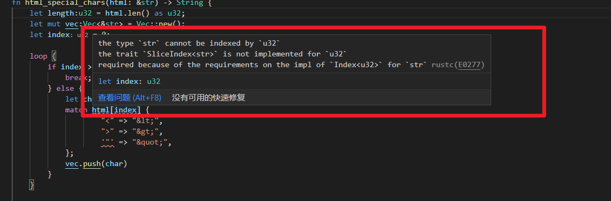

既然没有impl for u32，那么什么类型impl了。怎么查找。
***
```
fn solution(word: &str, ending: &str) -> bool {
    let word_rev:&str = word.chars().rev().collect();
    let ending_rev:String = word.chars().rev().collect();
```
&str会报错，怎么让它转为&str不报错。  

不可能指定为&str也不报错,&str只是个借用，不是具体的值,怎么可能collect过后没有具体的值,你得用string接住,而不是&str

let word_rev:&str = &word.chars().rev().collect::<String>();  
这样就行了。
***
